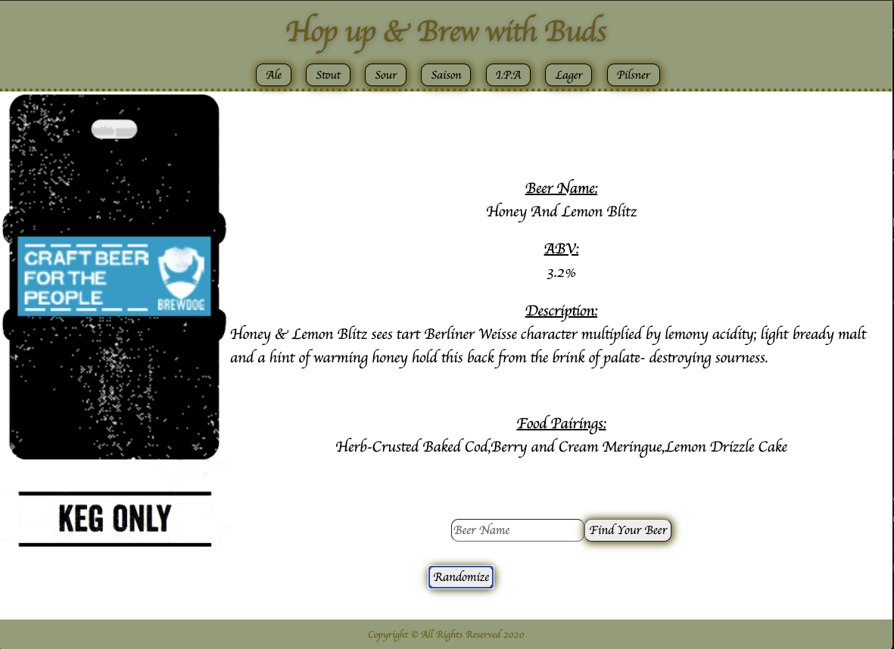
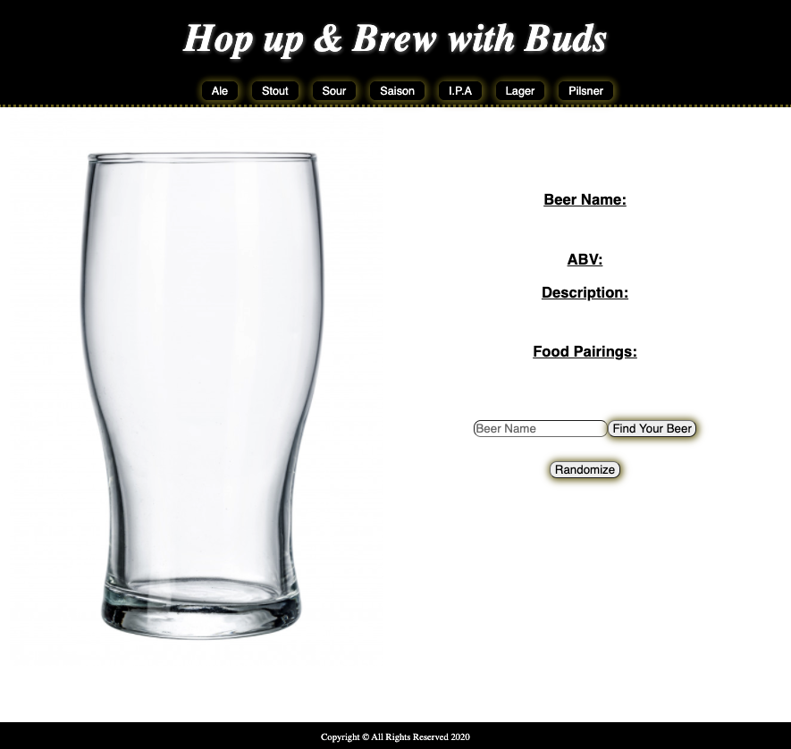
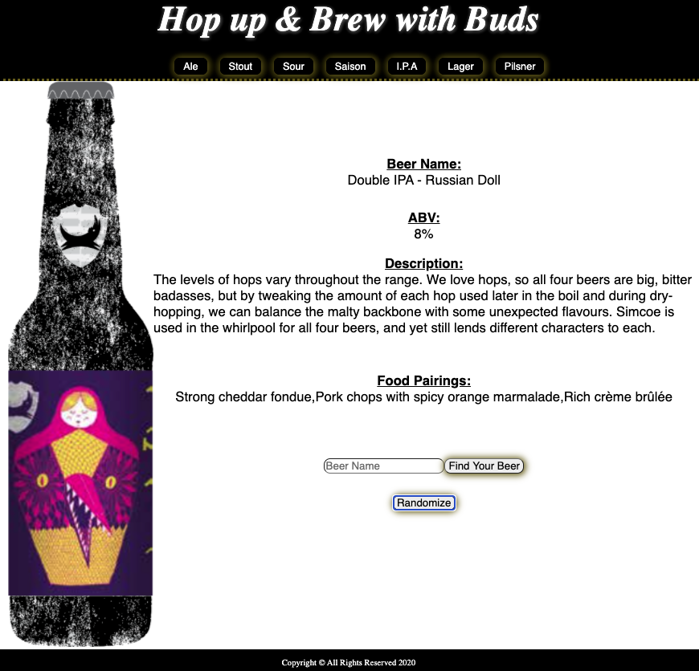

# Hop up & Brew with Buds

A simple web application that displays beer information related to the beer that a user inputs. A random beer can also be generated by the click of a button.

## Technologies Used 

- HTML5
- CSS3
- Javascript
- jQuery
- Google Fonts
- Beer API

## Screenshots
### Wireframe:

### In the midst:

### Before user input:

### After Input:

## Getting Started
[Click Here](#) to see the deployed app!

## Future Enchancements
 - the ability to favorite and save beer from local storage
 - connecting to an API with more beers
 - making a beers default image, the image that I have hard coded in
 - having a sound for the randomize button