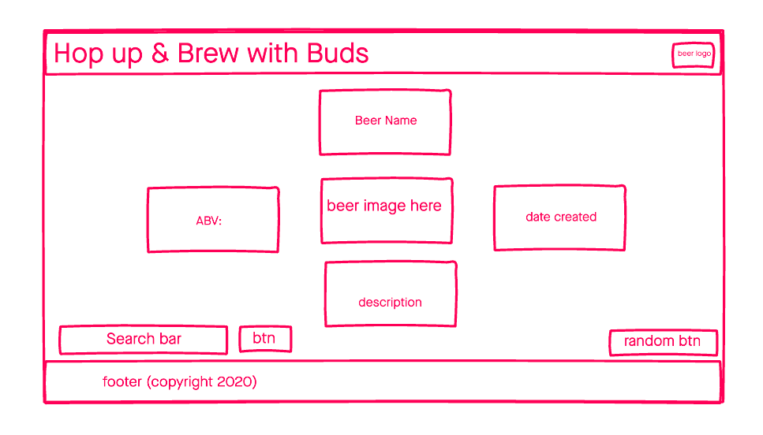

# Hop up & Brew with Buds

A simple web application that displays beer information related to the beer that a user inputs. 

## Technologies Used 

- HTML5
- CSS3
- Javascript
- jQuery
- Google Fonts
- Beer API

## Screenshots

## Getting Started
[Click Here](#) to see the deployed app!

## Future Enchancements
 - the ability to generate a random beer from the click of a button 
 - the ability to favorite and save beer from local storage